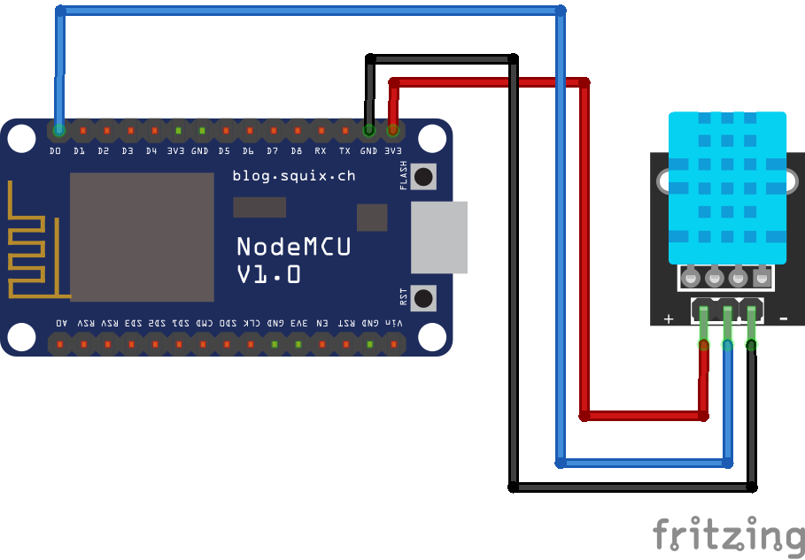

# ESP8266 Webserver project

In this project, we using:

- WebServer
- WebSockets
- mDNS
- DHT11
- Timer

# Features

- Control builtin LED from web page
- Sync LED state crossing all devices
- Showing temperature and humidity from DHT11 to web page

# Connections

# Demo

 

# Tutorial

[https://youtu.be/GaU7vvCM5d4](https://youtu.be/GaU7vvCM5d4)
